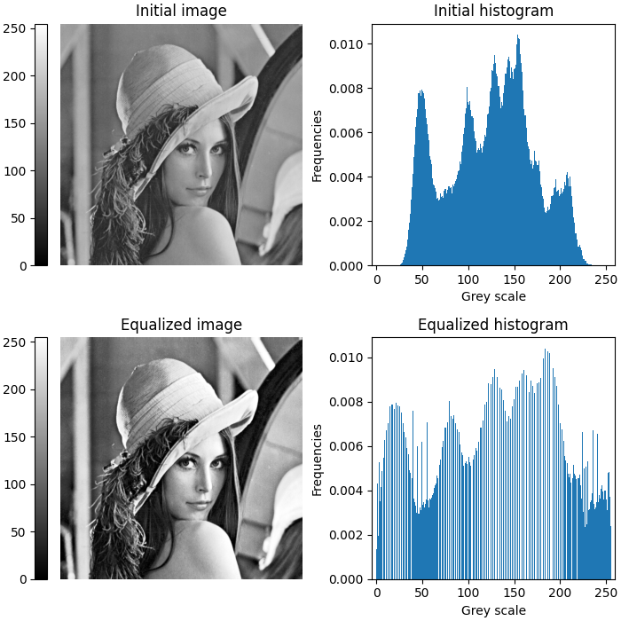

# Computer Vision Projects

A collection of computer vision projects implemented in various languages

## Detecting Faces with SVMs

A simple face detector that uses a Support Vector Machine (SVM) trained on Histograms of Oriented Gradients (HOG).

The HOG pattern learned by the SVM:

Face detection example:

## Histogram Equalization

An implementation of the contrast enhancement technique known as histogram equalization.

