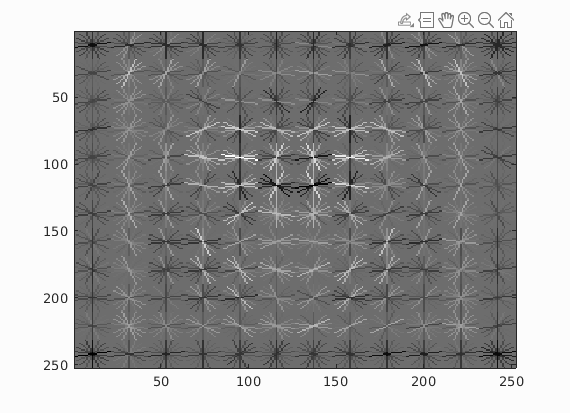
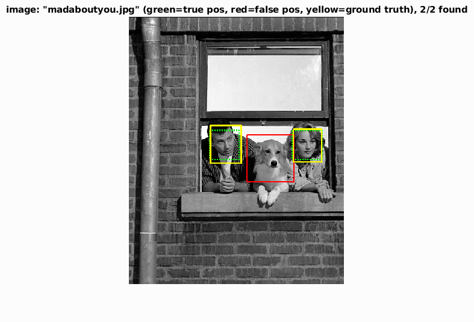
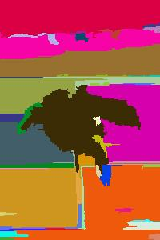
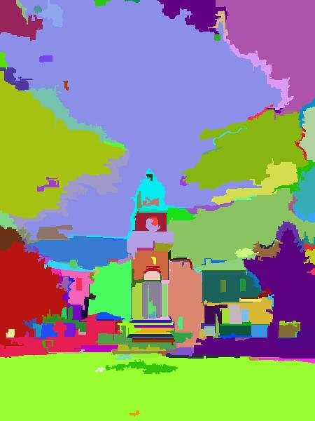
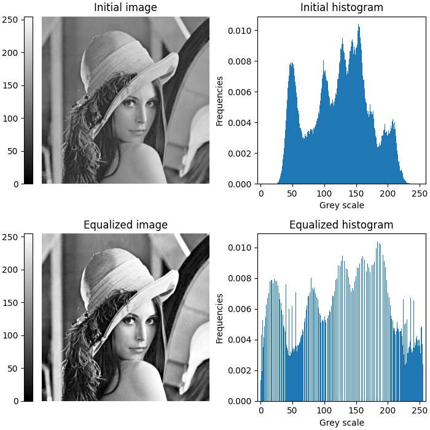

# Computer Vision Projects

A collection of computer vision projects implemented in various languages

Check out the project overviews below.

## Detecting Faces with SVMs [⤴](./face_detection_with_SVMs)

A simple face detector that uses a Support Vector Machine (SVM) trained on Histograms of Oriented Gradients (HOG).

The HOG pattern learned by the SVM:

Face detection example:

## Efficient Graph-Based Image Segmentation [⤴](./graph_based_image_segmentation)

A fast Python implementation of the classic image segmentation algorithm by Felzenszwalb and Huttenlocher.

Examples:

- beach.jpg:

- Ioannina clock tower:

 

## Seam Carving for Content-Aware Image Resizing [⤴](./seam_carving_octave)

An octave implementation of the classic image resizing algorithm.

The vertical/horizontal seams with the lowest energy are iteratively removed until the target width/height is reached.

[lake_preview.webm](https://github.com/user-attachments/assets/db24761c-e2ba-43b6-97a7-0f5be9e24fad)

## Histogram Equalization [⤴](./histogram_equalization)

An implementation of the contrast enhancement technique known as histogram equalization.

