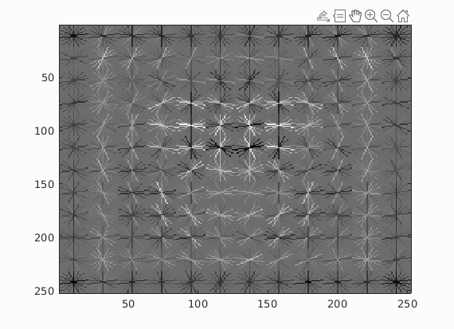
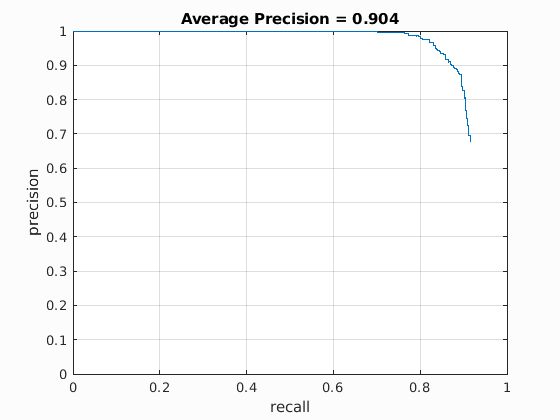
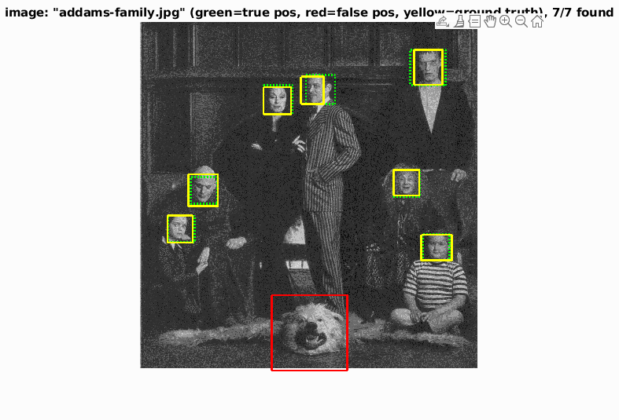
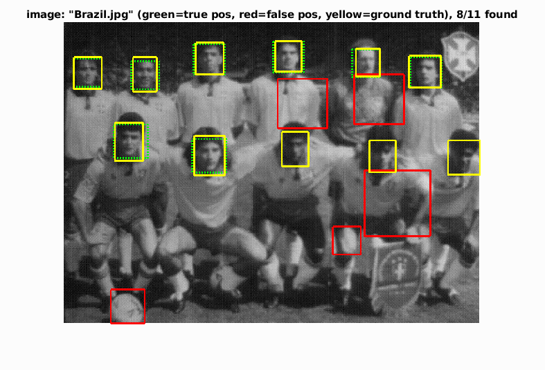
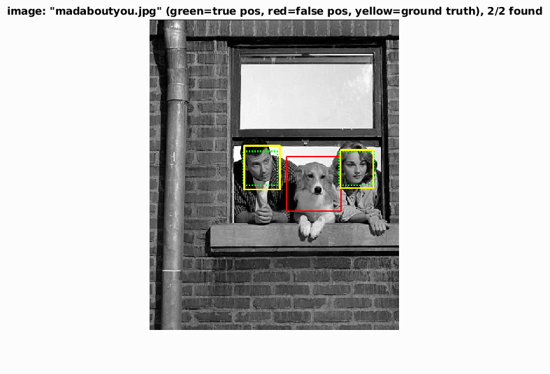
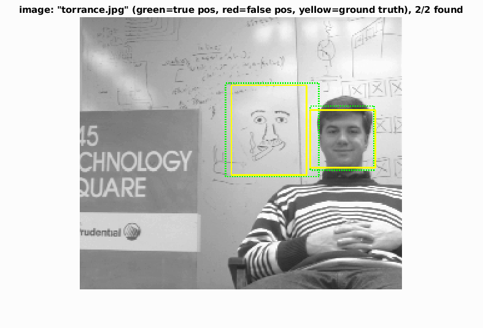
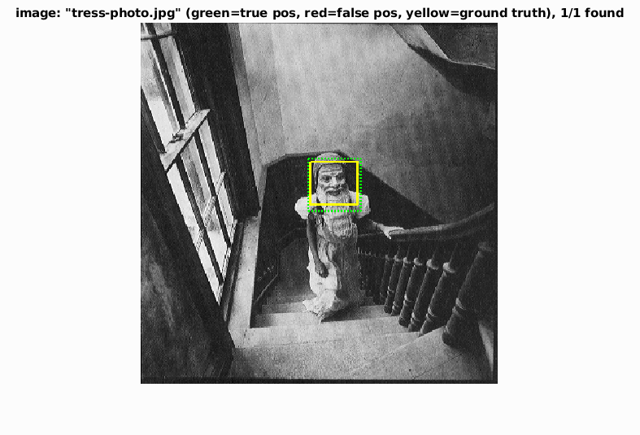

# Detecting Faces with SVMs

A simple face detector that uses a Support Vector Machine (SVM) trained on Histograms of Oriented Gradients (HOG).

The SVM was trained on a database of 6,713 cropped 36x36 faces (and their horizontal mirrorings) extracted from the Caltech Web Faces project. Negative examples were randomly sampled from a database of images without faces.

For each image, HOG were computed. When the image size exceeds 36x36, a sliding window approach is used. Training on these HOGs, the SVM learns to detect faces.

## The HOG pattern learned by the SVM

## Although relative simple, the system exhibits surprisingly high accuracy

## Some examples from ./code/visualizations

