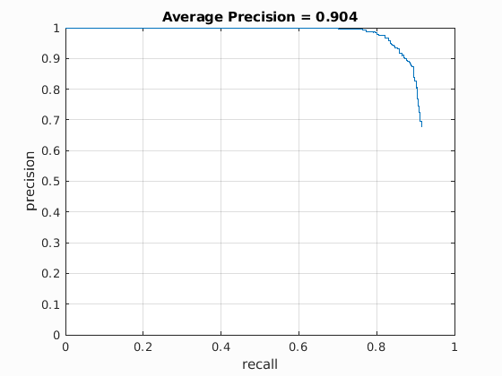
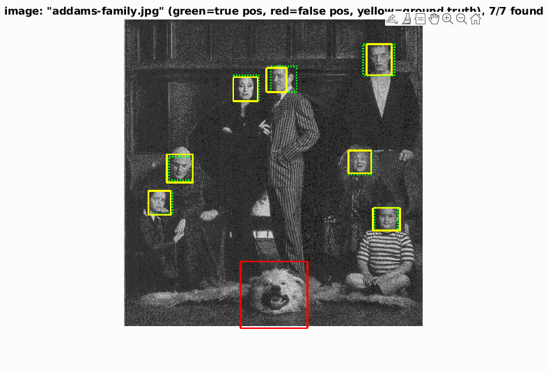
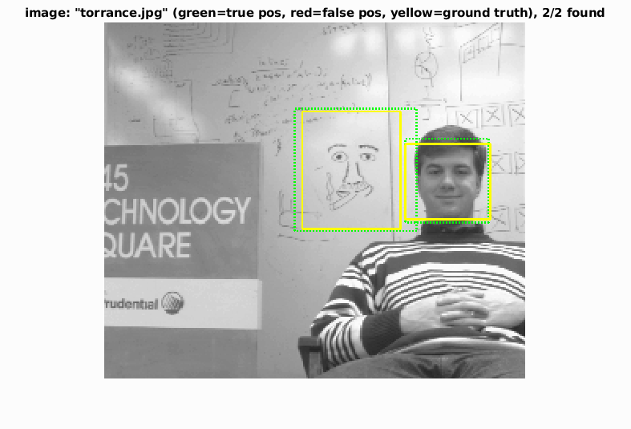

# Detecting Faces with a Linear SVM

The SVM was trained on a database of 6,713 cropped 36x36 faces (and their horizontal mirrorings) extracted from the Caltech Web Faces project. Negative examples were randomly sampled from a database of images without faces.

For each image, the Histogram of Oriented Gradients (HOG) was computed. When the image size exceeds 36x36, a sliding window approach is used.
From all those HOGs, the SVM learns to detect faces. 

### The HOG pattern learned by the SVM

### Although relative simple, the system exhibits surprisingly high accuracy

### Some examples from ./code/visualizations

