# Efficient Graph-Based Image Segmentation

A fast python implementation of the classic image segmentation algorithm:

> Felzenszwalb, P.F., Huttenlocher, D.P.
> *Efficient Graph-Based Image Segmentation.*
> *International Journal of Computer Vision* 59, 167-181 (2004).
> [https://doi.org/10.1023/B:VISI.0000022288.19776.77](https://doi.org/10.1023/B:VISI.0000022288.19776.77)

The algorithm is implemented with a Numba-accelerated union-find (disjoint-set) data structure for improved performance.

```console
➜ python graph_based_image_segmentation.py -h
usage: graph_based_image_segmentation.py [-h] --input INPUT [--output OUTPUT]
                                         [--scale-factor SCALE_FACTOR]
                                         [--sigma SIGMA]
                                         [--minimal-acceptable-size MINIMAL_ACCEPTABLE_SIZE]
                                         [--palette {mean,random}]
                                         [--weighting-function {p>=1 or p==0}]
                                         [--branding] [--verbose]

An implementation of the image segmentation algorithm introduced in: Felzenszwalb, P.F.,
Huttenlocher, D.P. Efficient Graph-Based Image Segmentation. International Journal of
Computer Vision 59, 167-181 (2004). https://cs.brown.edu/people/pfelzens/papers/seg-ijcv.pdf

options:
  -h, --help            show this help message and exit
  --input INPUT, -i INPUT
                        path to the input image
  --output OUTPUT, -o OUTPUT
                        path to the output image
  --scale-factor SCALE_FACTOR, -k SCALE_FACTOR
                        positive scale constant controlling the trade-off between detail
                        and region size (default: 300.0)
  --sigma SIGMA, -s SIGMA
                        positive constant employed in the pre-segmentation blurring
                        (default: 0.8)
  --minimal-acceptable-size MINIMAL_ACCEPTABLE_SIZE, -m MINIMAL_ACCEPTABLE_SIZE
                        positive value defining the minimum size (in pixels) of an
                        acceptable component (default: 50.0)
  --palette {mean,random}, -p {mean,random}
                        color palette used in the output image (default: random)
  --weighting-function {p>=1 or p==0}, -l {p>=1 or p==0}
                        function measuring similarity between neighboring pixels; choose
                        any float p>=1 to use Lp(x,y) = (sum_i |x_i - y_i|^p)^(1/p), or
                        p=0 for L_infinity(x,y) = max_i |x_i - y_i| (default: 2.0)
  --branding, -b        include the input parameters in the name of the output file
  --verbose, -v         display processing steps and timing information

```

## Gallery

### Effect of the scale factor k (the L∞ distance is used)

| **Input** | **k=100** | **k = 300**|
|:--:|:--:| :--: |
|  | 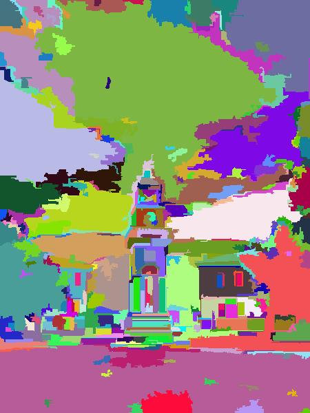 | 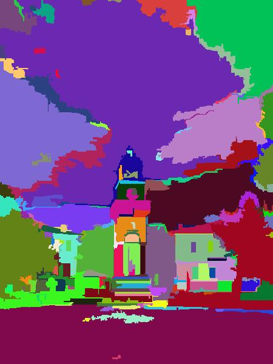 |
| **k = 650** | **k = 1000** | **k = 1500** |
| 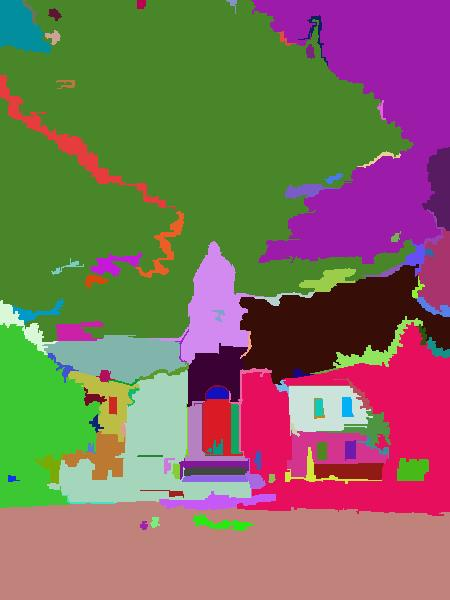 | 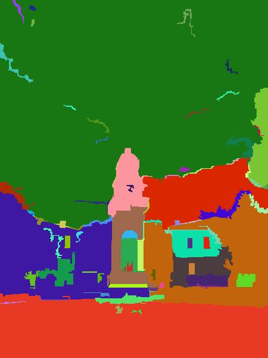 | 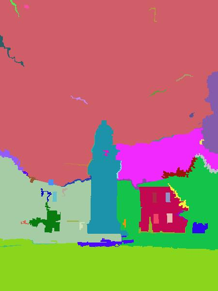 |

### Comparison of segmentations across different distance function (k=300)

| **Input** | **L₁** |
|:--:|:--:|
|  | 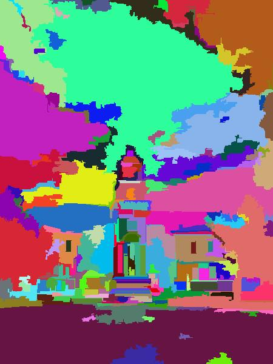 |
| **L₂** | **L∞** |
| 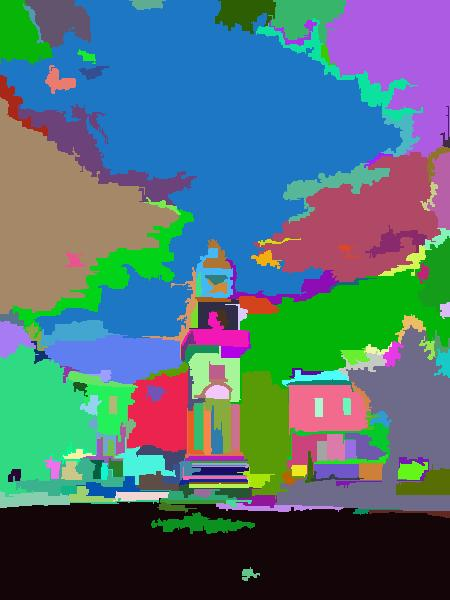 |  |

### Example of color quantization

When the mean value is used, a nice pixelation effect occurs:

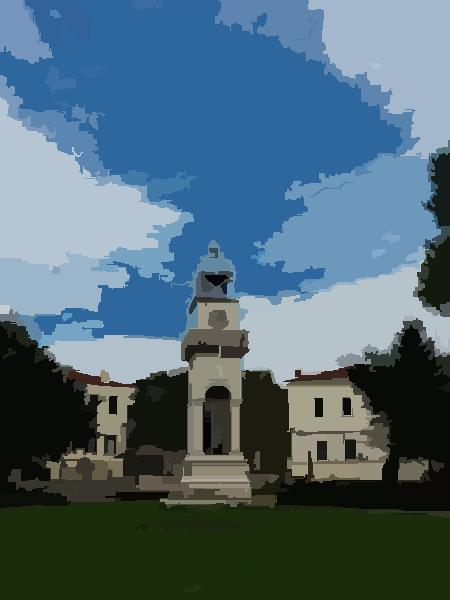

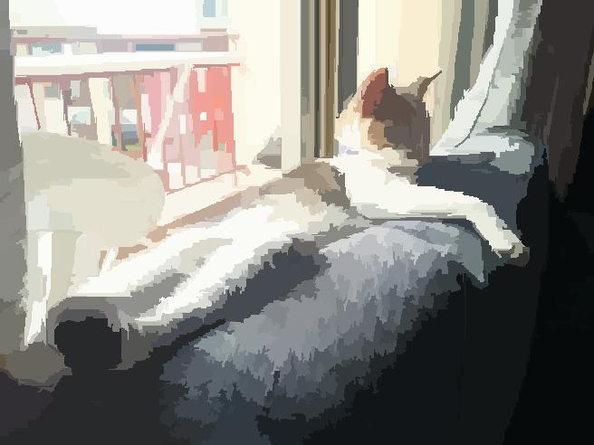

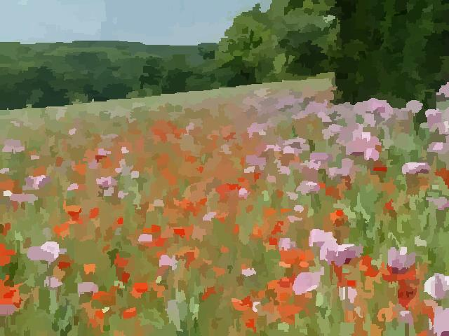

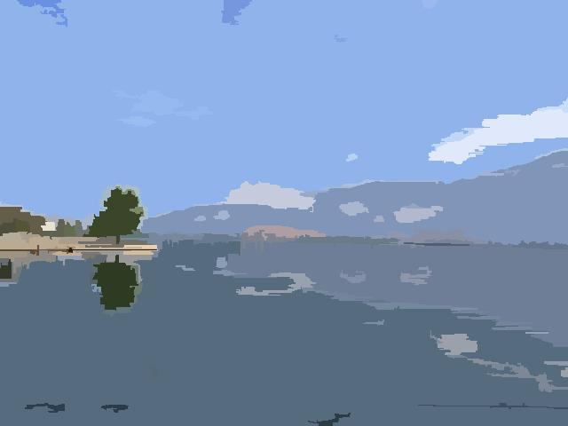