# Seam Carving for Content-Aware Image Resizing

An Octave implementation of the classic image resizing algorithm:

> Avidan, S., Shamir, A.
> *Seam carving for content-aware image resizing.*
> *ACM Transactions on Graphics* 26, 10 (2007).
> [https://doi.org/10.1145/1276377.1276390](https://doi.org/10.1145/1276377.1276390)

Requires the `image` (`pkg install -forge image`) and `video` (`pkg install -forge video`) packages.

```console
➜ octave functions/main.m
Usage: octave main.m <input> <output> <reduction direction {v|h}> <amount> <p for L_p or 0 for L_infinity> [--animations]
```

## Gallery

The minimum-energy vertical or horizontal seams (shown in red) are iteratively removed until the target image dimensions are reached.

| Image | Energy Map | Cumulative Energy Map |
| :---: | :---: | :---: |
||||
||||

Examples of resized images:

| Original | Resized | Reduction |
| :---: | :---: | :---: |
| 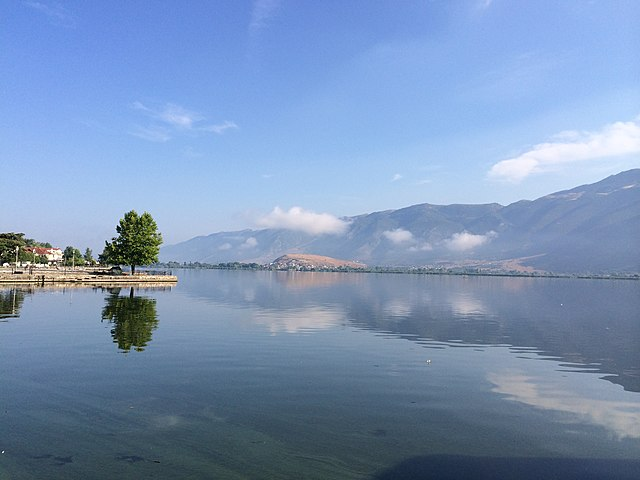 | 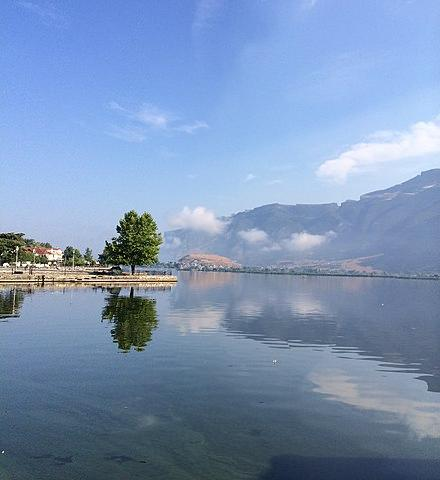 | -200 px width |
|  | 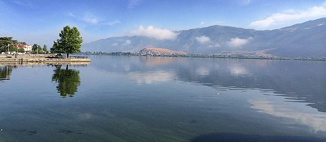 | -200 px height |
| 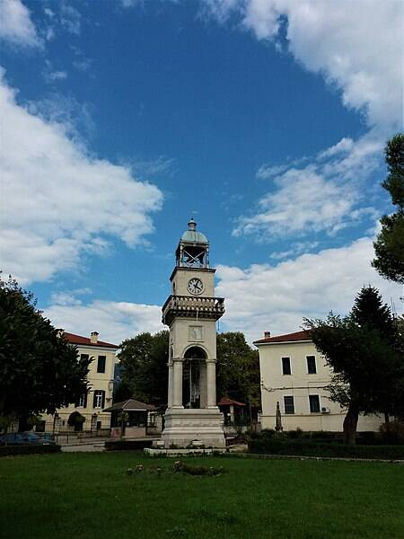 | 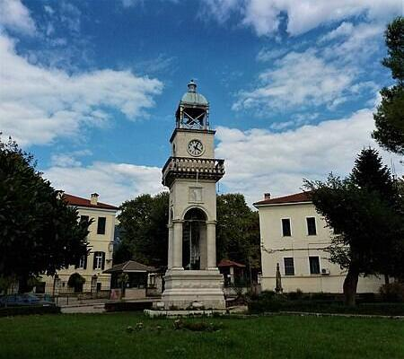 | -200 px height |
|  | 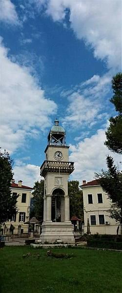 | -200 px width |
| 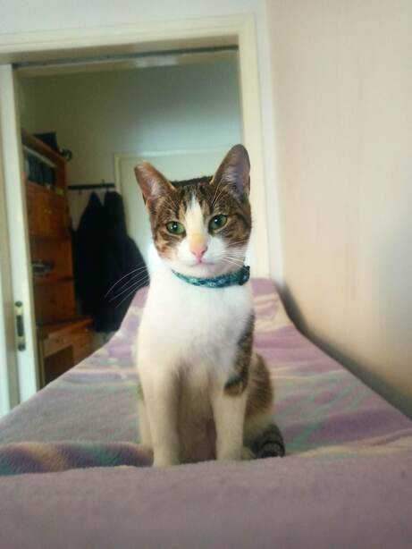 | 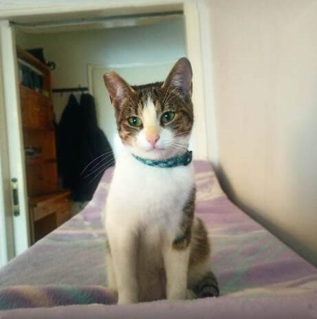 | -150 px height |
| 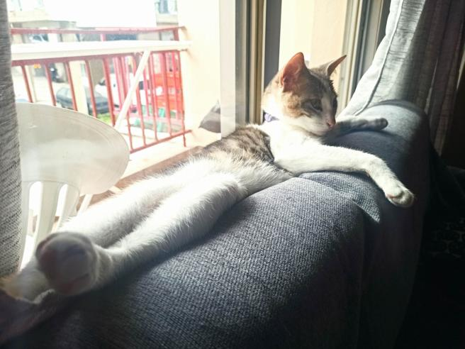 | 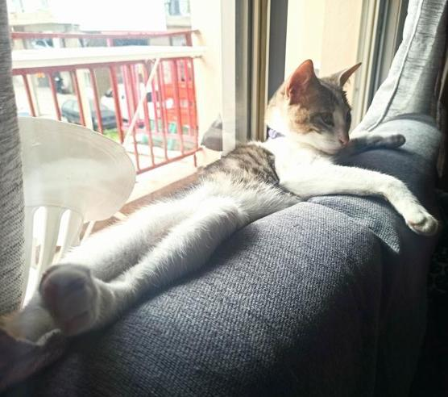 | -100 px width |
| 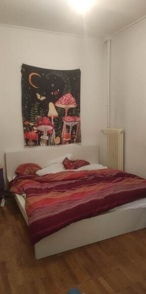 | 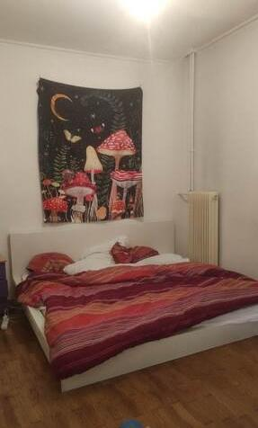 | -100 px height |
| 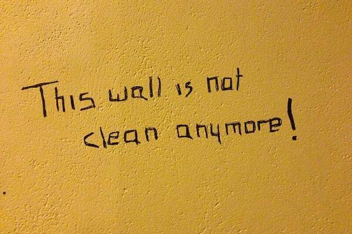 | 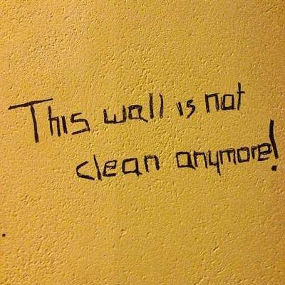 | -200 px width |
| 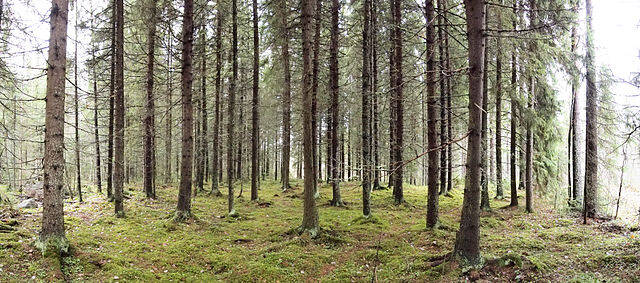 | 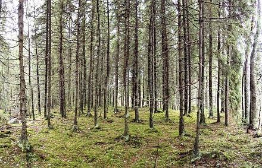 | -200 px width |
| 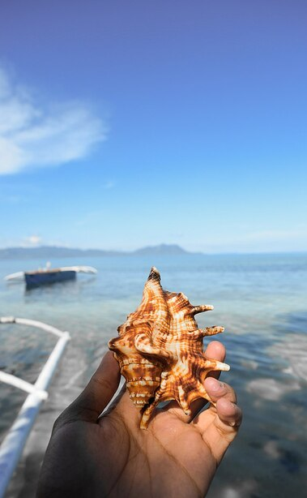 | 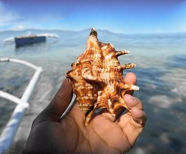 | -300 px height |
| 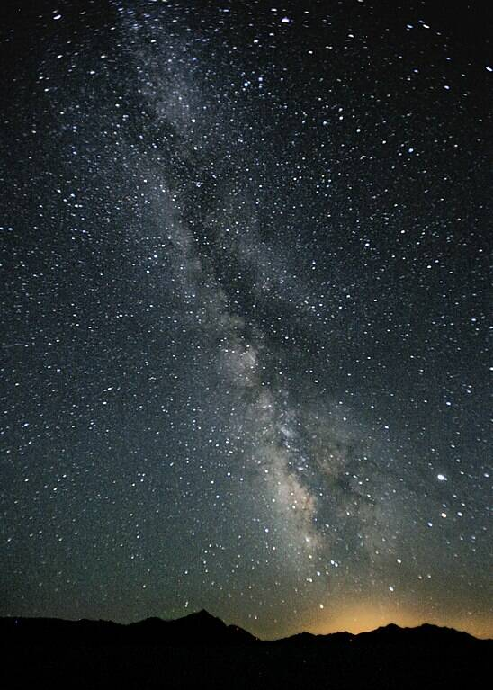 | 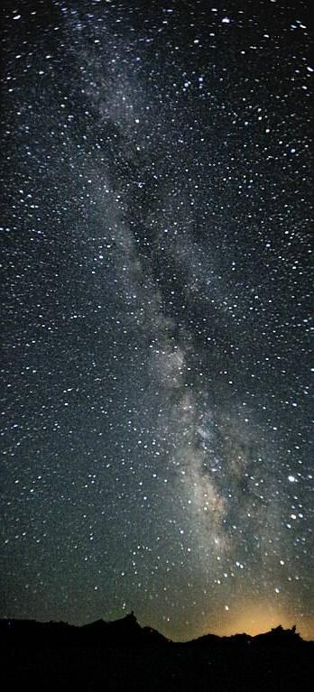 | -200 px width |